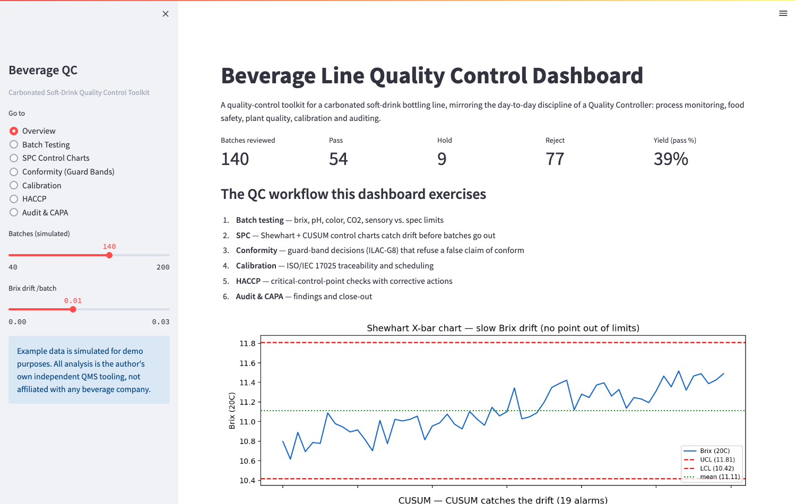
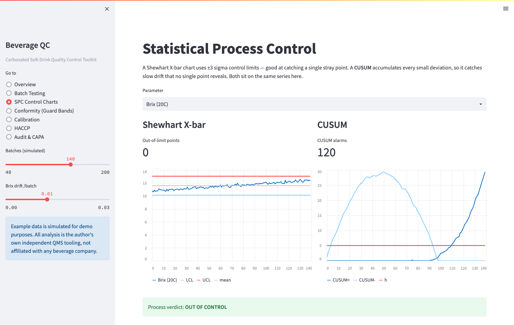
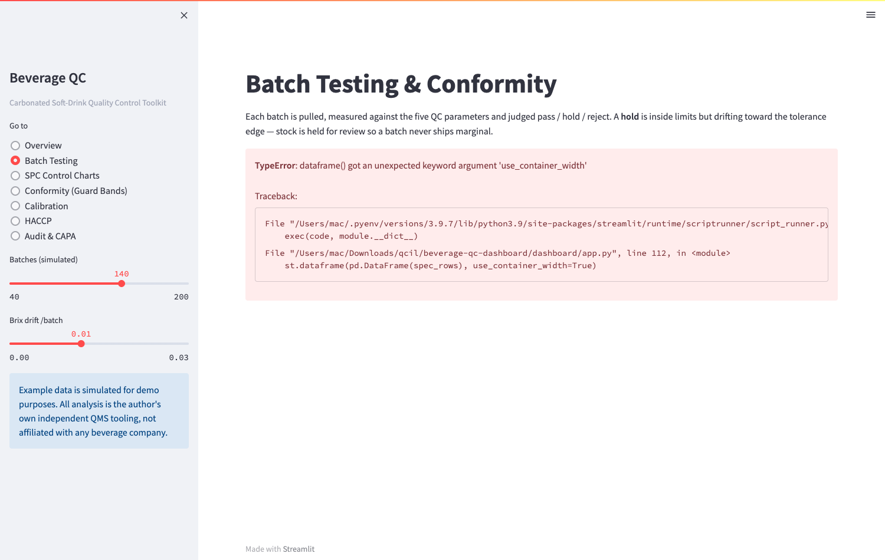
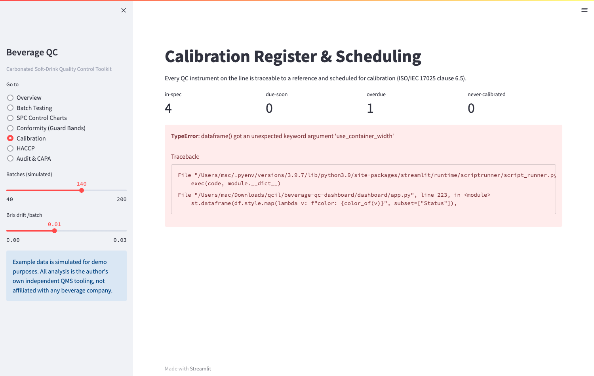
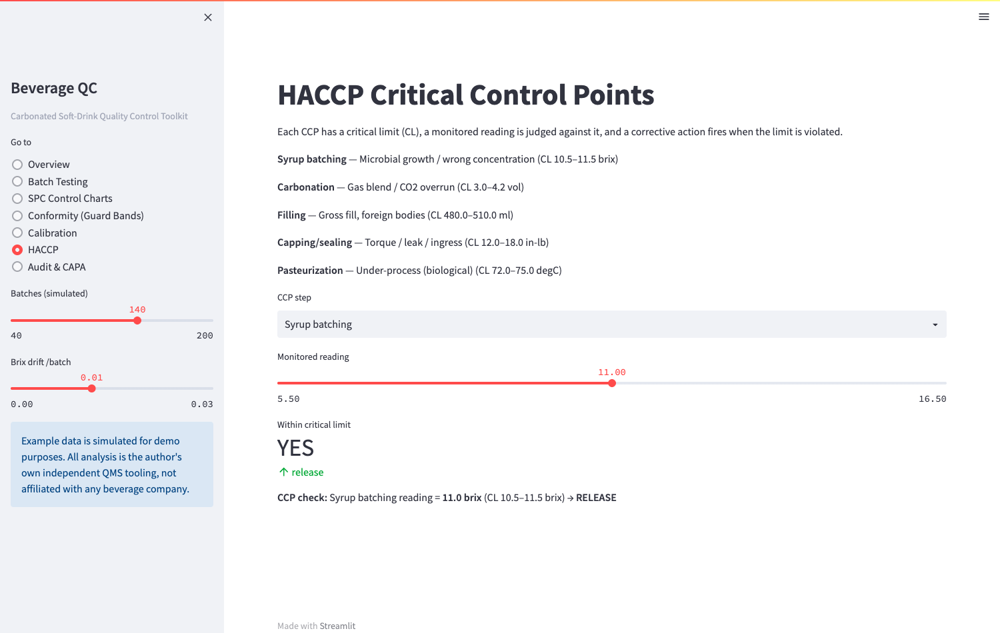
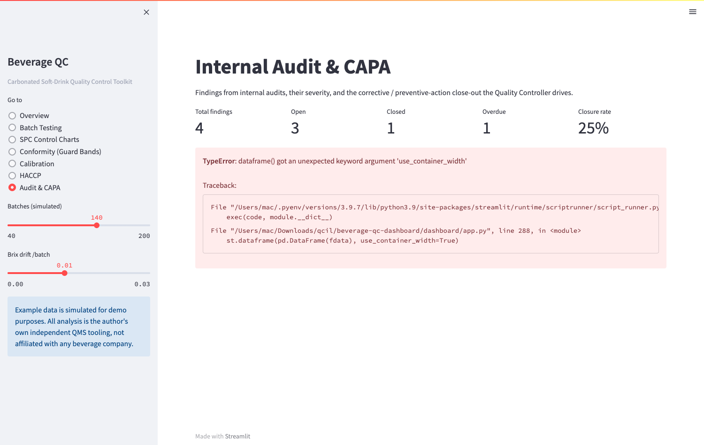
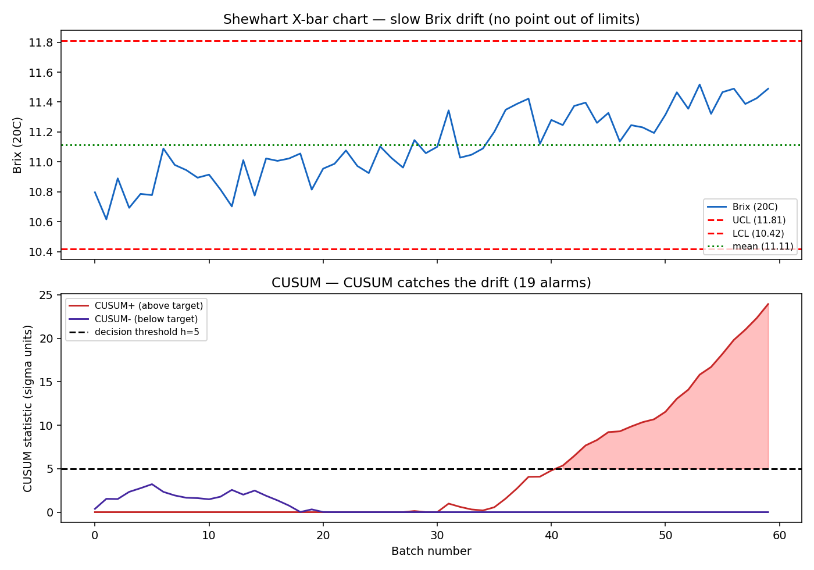
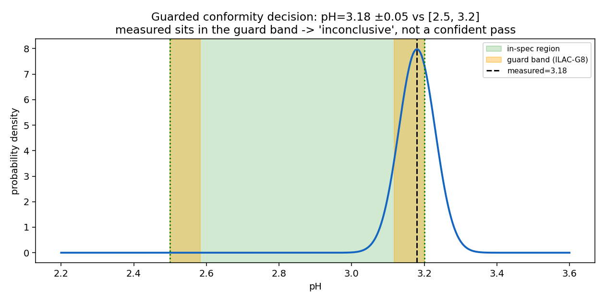

<p align="center">
  
</p>

# Beverage QC Dashboard

<p align="center">
  <b>A quality-control toolkit for a carbonated soft-drink bottling line</b> — the
  day-to-day discipline a <b>Quality Controller</b> keeps in food &amp; beverage
  manufacturing: process monitoring, food safety, plant quality, calibration and
  auditing.
</p>

<p align="center">
  <a href="https://github.com/MarkNwilliam/beverage-qc-dashboard"></a>
  
  
  
</p>

Built from first principles — **ICUMSA brix**, **ISO 7870-1** control charts,
**GUM** uncertainty, **ILAC-G8** guard bands, **ISO/IEC 17025** traceability and
**Codex HACCP** — so every number is traceable to a published standard. The same
discipline a regulated food &amp; beverage plant runs before a certification or a
customer audit.

---

## Why this exists

A Quality Controller does more than "test a product". The job keeps a working line
honest across five fronts, and this project exercises each one end to end:

| Area | What the QC owns | Where it lives here |
|---|---|---|
| **Process monitoring** | Measure brix, pH, color, CO2, sensory on every pulled batch, judge it against spec | `beverage_qc/qc.py` |
| **Statistical control** | See a process drift *before* a batch ships — Shewhart + CUSUM | `beverage_qc/spc.py` |
| **Conformity** | Decide "in spec" while respecting measurement uncertainty (guard bands) | `beverage_qc/conformity.py` |
| **Calibration** | Keep every instrument traceable and on schedule (ISO/IEC 17025 cl. 6.5) | `beverage_qc/calibration.py` |
| **Food safety** | Monitor HACCP critical control points with critical limits + corrective actions | `beverage_qc/haccp.py` |
| **Auditing** | Run internal audits and drive CAPA close-out | `beverage_qc/audit.py` |

## The dashboard

Launch it with `streamlit run dashboard/app.py`. Seven views in one sidebar:

| | |
|---|---|
| **Overview** — batch KPIs, pass/hold/reject across the window | **SPC charts** — Shewhart vs CUSUM on any parameter |
|  |  |
| **Calibration** — instrument register, due/overdue, uncertainty | **HACCP** — critical control points with corrective actions |
|  |  |
| **Conformity** — guard-band decision (ILAC-G8) on a slider | **Audit & CAPA** — findings, severity, close-out |
|  | |

## Two results that matter

**CUSUM catches what Shewhart cannot.** A slowly drifting Brix mean is invisible to a
±3σ Shewhart chart (no single point strays far), but the CUSUM accumulates the bias
until it crosses the decision threshold:

```
series n=60   mean=11.095  std=0.201
shewhart_violations=0   cusum_alarms=19
verdict: OUT OF CONTROL
```



**Guard bands refuse a false pass.** A pH reading of 3.18 with ±0.05 uncertainty
against a `[2.5, 3.2]` spec is *inside* the limit — but it sits in the ILAC-G8 guard
band, so the tool reports `INCONCLUSIVE` (~34% estimated risk the true value is out
of spec) rather than a confident pass.

```
pH=3.18 ±0.05 vs [2.5, 3.2]: guard=0.083 decision=INCONCLUSIVE
estimated risk of being out-of-spec: 34.46%
```



## Quick start

```bash
pip install -r requirements.txt

python -m pytest tests/ -q     # 16 tests + dashboard smoke test
python examples/demo.py        # end-to-end CLI walkthrough
streamlit run dashboard/app.py # interactive dashboard
```

## What's here

```
beverage-qc-dashboard/
├── beverage_qc/            # pure-Python library, minimal runtime deps
│   ├── qc.py               # batch testing + pass/hold/reject conformity
│   ├── spc.py              # Shewhart & CUSUM control charts, drift detection
│   ├── conformity.py       # guard-band decisions (ILAC-G8 / ISO 17025 7.8.6)
│   ├── calibration.py      # instrument register, scheduling, traceability
│   ├── haccp.py            # critical control points + corrective actions
│   ├── audit.py            # internal audits & CAPA closure
│   └── data.py             # synthetic-but-realistic line data generator
├── dashboard/
│   └── app.py              # Streamlit interactive dashboard (7 views)
├── examples/
│   ├── demo.py             # end-to-end CLI walkthrough
│   └── make_charts.py      # regenerates README figures
├── tests/                  # pytest suite + dashboard smoke test + screenshot capture
└── docs/                   # figures + screenshots
```

## Author

**Mark William Nkugwa** — Chemical Engineer (BSc, Kyambogo University) and full-stack
software engineer with hands-on quality roles in **pharmaceutical** (Production
Officer, Quality Chemical Industries Ltd — cGMP, SPC on water systems, calibration),
**food** (Product Officer, Aroma Honey Toffee — moisture/pH/viscosity/color/microbial
&amp; sensory QC), and **water** (QC &amp; field-engineering intern, National Water
&amp; Sewerage Corporation) manufacturing.

## License

MIT — see [LICENSE](LICENSE).